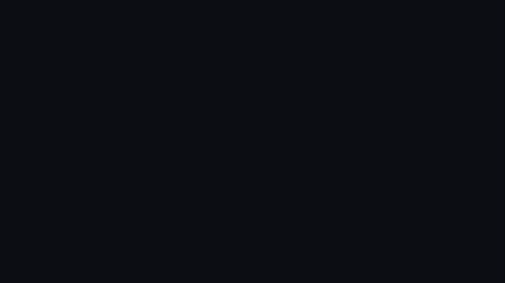

# reelcn

Copy-paste Remotion components that fit every format and restyle from one theme.



reelcn is a [shadcn](https://ui.shadcn.com) registry for video. You add an item with one command, its source lands in your project, and you edit your video like any other React code.

<!-- install:start -->
## Install

Start a Remotion project, then add any item. Files land in `src/reelcn/`; no config and no path aliases.

```bash
npx create-video@latest
npx shadcn@latest add https://www.reelcn.dev/r/text-reveal.json
```

Browse every item with live previews at https://www.reelcn.dev/docs/components.

Agents: `npx skills add Karanjot786/reelcn` installs the reelcn skill, and https://www.reelcn.dev/llms.txt lists the whole catalog.
<!-- install:end -->

## What you get

- **One component, every format.** Items size themselves with design units and platform safe zones, so the same code renders at 16:9, 9:16 and 1:1.
- **Six themes and brand kits.** One `theme` prop sets colors, fonts, corner radius and motion across every item.
- **Captions and audio.** A captions engine with 8 styles, local Whisper transcription, 30 CC0 sound effects and audio visualizers.
- **Templates and storyboards.** 14 templates, plus a storyboard that renders a JSON story and works out its length from the content.
- **Built for agents.** `llms.txt`, a catalog with use and avoid notes, the shadcn MCP server, and an installable skill.
- **Deterministic renders.** CI renders every demo in all 3 formats, renders sampled frames twice, and fails on any pixel difference.

## Catalog

<!-- catalog:start -->
142 items.

| Category | Items | Examples |
|---|---|---|
| lib | 10 | `chart-scale`, `code-tokens`, `core-math`, `core-physical-light`, `core-stroke`, … |
| text | 18 | `blur-in`, `char-rise`, `counter`, `drop-in`, `fit-title`, … |
| motion | 8 | `animate`, `bento-grid`, `camera`, `marquee`, `space`, … |
| transitions | 15 | `brand-sweep`, `card-push`, `circle-burst`, `glitch`, `light-flash`, … |
| backgrounds | 10 | `aurora`, `beams`, `bokeh`, `brand-solid`, `dots`, … |
| overlays | 10 | `arrow`, `callout`, `confetti`, `flash`, `light-leak`, … |
| product | 17 | `app-window`, `before-after`, `browser-window`, `button`, `chat-thread`, … |
| social | 19 | `captions-bold-pop`, `captions-boxed`, `captions-highlight-box`, `captions-karaoke`, `captions-minimal`, … |
| data | 10 | `area-chart`, `bar-chart`, `bar-race`, `donut`, `kpi-grid`, … |
| audio | 6 | `audio-reactive`, `radial-visualizer`, `speaker-card`, `spectrum`, `use-beat`, … |
| templates | 15 | `app-promo`, `audiogram`, `changelog`, `data-story`, `feature-short`, … |
| tools | 4 | `check-determinism`, `contact-sheet`, `sfx-pull`, `transcribe` |
<!-- catalog:end -->

## Develop

```bash
pnpm install
pnpm studio   # every demo in every format
pnpm site     # docs site
```

See [CONTRIBUTING.md](CONTRIBUTING.md) to add an item.

## License

reelcn is [MIT](LICENSE). Sound effects are CC0. Theme fonts load from Google Fonts under the SIL Open Font License.

reelcn depends on Remotion, which has its own license. Individuals, non-profits and companies of up to 3 people use it free; larger companies need a Remotion Company License.
